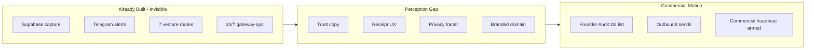

# Sina Gateway — 2026 Upgrade Plan (from Deep Research)

**Source:** `deep-research-report (3).md` (external-only audit, 2026-07-06)  
**Reconciled with:** live runtime (`private-test` 6/6, `chain:health` PASS, Telegram, Supabase `tkgpapowwplupyekpivy`)  
**Verdict bridge:** Report says **Intake MVP** (public perception). Runtime says **Private-test PASS** (ops backend). Gap = **visibility + trust**, not missing capture.

---

## 1. Analysis — what the report got right

| Finding | Accurate for a cold visitor? | Backend reality |
|---------|------------------------------|-----------------|
| Intake structure visible | Yes | Wizard + routing engine exist |
| Named ventures absent from hero | Yes | Routes exist in `app.js` / `gateway.js` but not in static copy |
| Submit not externally verified | Yes (auditor did not submit) | `POST /api/leads` works; FounderAudit capture PASS |
| No confirmation/receipt language | Partially | Success screen exists but no reference ID, SLA, or email |
| No privacy/terms | Yes | Not on page |
| No operator identity | Yes | Personal project; not stated publicly |
| Railway hostname hurts trust | Yes | Still `*.up.railway.app` |
| Shareability: LinkedIn/investor/client = not yet | Yes | Correct until trust layer ships |

**Core insight:** You have a **working routing machine** wearing an **unfinished commercial coat**. Upgrades should make real behavior **legible**, not add fake proof.

---

## 2. Brainstorm — five upgrade vectors

| Vector | ROI | Cost | Never fake |
|--------|-----|------|------------|
| **A. Trust surface** | Unlocks shareability | Low (copy + footer) | No fake testimonials or SLAs you won't honor |
| **B. Receipt layer** | Kills "black hole" fear | Low–med | Show real `requestId` + route; email only when wired |
| **C. Lane explainer** | Converts abstract → confidence | Low | Map to real `ROUTES` in code |
| **D. External proof** | Status/UptimeRobot links | Free | Only link monitors that exist |
| **E. Commercial motion** | Heartbeat GREEN | Time | `sync:heartbeat` only after real sends logged |

---

## 3. Phased 2026 roadmap

| Phase | Window | Goal | Unlocks |
|-------|--------|------|---------|
| **0 — Truth** | Done | Ops PASS, CI green, gateway-only Telegram | Internal confidence |
| **1 — Commercial Beta** | Jul 2026 | Trust + receipt + lane copy on page | DM, warm network, collaborator caveat |
| **2 — Hardened Beta** | Aug 2026 | Turnstile, UptimeRobot armed, custom domain | Low-volume LinkedIn, client beta |
| **3 — Public Gateway** | Sep–Oct 2026 | Remove noindex, privacy URL, email ack | Investor intro, profile link |
| **4 — Motion** | Q4 2026 | D2/D3 Founder Audit, commercial heartbeat | Doctrine §6 commercial GREEN |

---

## 4. The 202 upgrades

### Block A — Commercial beta blockers (report P0) · 1–25

1. Show `requestId` on post-submit success screen (from API response).
2. Show venture route name on success (already partial — add next-step copy).
3. Add hero routing explainer naming SourceA, Noetfield, TrustField, BuildMatch, Forge, Personal, FounderAudit.
4. Replace abstract "venture lane" with "review lane" in static HTML where user-facing.
5. Update route preview to label lane in plain English after step 1 (identity).
6. Update route preview after step 2 (intent) with predicted lane title.
7. Add "What happens next" section below hero (3 bullets, honest SLA).
8. Add footer operator line: personal founder project (no fake corp claims).
9. Add privacy mini-notice adjacent to submit button.
10. Add consent checkbox or inline consent copy near contact fields.
11. Add fallback contact line (founder-gated real email only).
12. Link `/health` from footer as "System status" (optional, proves backend exists).
13. Never claim email receipt until Cloudflare Email or provider is wired.
14. Add success copy: "Signal captured — reference #XXXX" using requestId slice.
15. Add "Send another signal" button on success state.
16. Persist success state in URL hash or sessionStorage for refresh recovery.
17. Show capture error with requestId when 502/422 (already in API — surface in UI).
18. Add Turnstile widget before public launch (Step 4 of 10-step plan).
19. Run one real browser submit recorded in readiness receipt after each deploy.
20. Document externally verifiable test in `GATEWAY_PRIVATE_TEST_READINESS_RECEIPT_v1.md`.
21. Add `/.well-known` or `/status` lightweight public status page (health + ready summary).
22. Ensure success screen mentions review window only if founder commits to it.
23. Add route confidence label on success only when ≥ threshold (avoid noise).
24. Block public indexing until Phase 3 (`noindex` stays until intentional).
25. Acceptance: cold visitor names correct lane in &lt;15s; submit shows reference ID.

### Block B — Trust & positioning copy · 26–45

26. Adopt report headline option: "One intake point for opportunities, capital, partnerships, and trusted introductions."
27. Subheadline naming client, investor, construction, collaborator, network signals.
28. "Who this is for" blurb with venture names (no overclaim on corp structure).
29. Remove or qualify "agentic" if it confuses non-technical visitors.
30. Add one-line per venture in collapsible "Routing map" section.
31. SourceA: governed AI execution (match `ROUTES.SourceA.promise`).
32. Noetfield: parent-company / strategic lane.
33. TrustField: trust and risk signals.
34. BuildMatch: construction / Vancouver home services.
35. Forge: builder/collaborator lane.
36. Personal: friend/network human lane.
37. FounderAudit: solo founder audit offer ($500 — only if offer doc is live).
38. Add `utm_campaign=founder-audit` landing variant copy in hero when param present.
39. OG tags updated to match new headline when launching.
40. Meta description names ventures explicitly.
41. Add `og:url` when custom domain exists.
42. No fake ratings, logos, or client logos.
43. No "enterprise" language unless SKU is sold.
44. Align page copy with `ROUTING.md` rule IDs (internal consistency).
45. Acceptance: report re-audit finds venture names on page.

### Block C — Privacy, legal, consent · 46–60

46. Add `/privacy` static page (founder-authored, minimal).
47. Link privacy from footer and near submit.
48. State data used for routing and follow-up only.
49. State retention: review in Supabase; deletion on request (process doc).
50. Add `consent_to_contact` visible label (field exists — label it).
51. Add `privacy_policy_version` in capture payload when migration on.
52. Log consent version server-side.
53. No Terms page until founder provides text.
54. No cookie banner unless analytics added.
55. Document data deletion in `docs/PRIVATE_TEST_CLEANUP.sql` pattern for production.
56. GDPR-style export: defer until volume warrants.
57. Do not log raw contact in server logs (verify today).
58. Honeypot field stays hidden.
59. Rate limit copy user-friendly on 429.
60. Acceptance: privacy visible without leaving page.

### Block D — Post-submit & acknowledgment · 61–75

61. Success template: route title + promise + next step (from `routeCopy`).
62. Display priority tag with plain-English meaning (high = same-day review intent).
63. Optional: show secondary route when present.
64. Telegram alert to `@Gateway_A` on high-priority (live — not user-visible).
65. Email acknowledgment via Cloudflare Email Service (Phase 3 — not fake).
66. Webhook path deprecated; Telegram only per ops docs.
67. Medium/low priority: no notification (document on privacy page).
68. Add `last_contacted_at` workflow in admin — deferred.
69. Confirmation does not promise auto-reply bot.
70. Store `submission_id` = lead id in DB (already).
71. Return submission id in API (already as lead.id).
72. Map lead.id to user-facing "Reference" on success.
73. Test success path in `private-test-runbook` asserts FounderAudit route.
74. Add E2E browser test for success DOM when CI allows headless.
75. Acceptance: submit once → visible receipt every time.

### Block E — Venture lane UX · 76–90

76. Wire `mirrorLine()` identity copy to hero lede dynamically (partially done).
77. Show lead type in mirror panel after step 0.
78. Show value + urgency in mirror panel as user progresses.
79. Priority preview updates live (partially done — audit all steps).
80. Route title updates before submit when config loaded.
81. Load `/api/config` on init for captureMode badge (dev/local warning).
82. Show "Live capture" badge when `captureMode=supabase`.
83. Hide technical badges from public in production (founder-only dev banner).
84. Construction path: Vancouver-specific placeholder in notes field.
85. Investor path: capital-specific placeholder.
86. Founder-audit campaign: dedicated notes placeholder.
87. Keyboard: tab order through option grids.
88. `aria-live` region for route preview updates.
89. Focus first option on step change.
90. Acceptance: selecting Investor → preview says capital/strategic lane language.

### Block F — Mobile & accessibility · 91–105

91. Test iPhone Safari viewport (375px).
92. Test Android Chrome viewport.
93. Tap targets ≥44px on radio labels.
94. No horizontal scroll on contact step.
95. Virtual keyboard does not hide submit on last step.
96. `prefers-reduced-motion` disables step transitions.
97. Color contrast audit on `.option-grid` selected state.
98. Screen reader: legend + label association audit.
99. Error messages associated with fields (`aria-describedby`).
100. Turnstile mobile rendering test when enabled.
101. Progress bar accessible name.
102. Back button on step 1 hidden/disabled correctly.
103. Form autocomplete attributes on name/contact.
104. Company field optional — clear optional labeling.
105. Acceptance: complete form on phone without zoom hacks.

### Block G — Domain, brand, hosting · 106–115

106. Register founder-chosen domain (e.g. `gateway.sinakazemnezhad.com` — founder decide).
107. Railway custom domain + TLS.
108. Update `ALLOWED_ORIGINS` env.
109. Redirect railway.app → custom domain (optional).
110. Update `gateway_link` in `channel-receipts.json`.
111. Update UptimeRobot monitors to custom domain.
112. Update `GATEWAY_BASE_URL` on gateway-ops worker.
113. LinkedIn shares use branded URL only after DNS live.
114. Keep railway URL as fallback in ops docs until cutover verified.
115. Acceptance: public link in outbound is not `*.railway.app`.

### Block H — External proof & monitoring · 116–130

116. Arm UptimeRobot monitor 1: `/health` keyword `ok`.
117. Arm UptimeRobot monitor 2: `/ready` status 200.
118. Do not cron POST endpoints in UptimeRobot.
119. CF `gateway-ops` remains primary alert motor.
120. GHA deadman 2×/day on `/ready` (live).
121. Public `/status` page: ok, version, captureMode (read-only JSON or HTML).
122. Link status from footer "All systems operational" when green.
123. No fake uptime percentages.
124. Telegram watchdog only on real infra RED.
125. Commercial heartbeat: `npm run sync:heartbeat` after real sends.
126. `COMMERCIAL_ARMED=true` only with real `channel-receipts.json` data.
127. No daily RED Telegram for `offers_sent=0` when not armed.
128. Document ROI stack in `GATEWAY_247_AUTORUN_SETUP.md` (done).
129. Delete test rows before public launch (`PRIVATE_TEST_CLEANUP.sql`).
130. Acceptance: 7 days green watchdog before launch gate.

### Block I — Shareability channel gates · 131–145

131. LinkedIn profile link: **not until Phase 3** (report aligned).
132. LinkedIn DM: **yes with caveat** after Phase 1 receipt + privacy.
133. Investor intro: **not until** operator identity + confirmation behavior visible.
134. Client intake: **not until** Turnstile + privacy + domain (Phase 2–3).
135. Collaborator: **yes with caveat** after lane explainer (Phase 1).
136. Friend/network: **yes with caveat** after receipt ID (Phase 1).
137. Founder Audit outbound: separate `utm_campaign=founder-audit` links only.
138. No NOOS/SourceA cross-posting to `@Gateway_A`.
139. Receipt doc updated when channel unlocked.
140. Each unlock requires `npm run private-test` PASS same day.
141. Record share date in `channel-receipts.json`.
142. Stop D3 at 100 sends / 0 L1 per doctrine.
143. No paid ads until L2 proof or explicit founder decision.
144. Press/media: not before Phase 3.
145. Acceptance: shareability table in report flips to "yes" per channel.

### Block J — Founder Audit commercial motion · 146–160

146. Fill `data/founder-audit-d2-list.json` to 25 names (fit_score ≥ 4).
147. Run `npm run validate:d2-list` → 25/25 ready.
148. Execute D3 template from `FOUNDER_AUDIT_D3_OUTBOUND_TEMPLATE_LOCKED_v1.md`.
149. Log each send in `channel-receipts.json` (`sent`, `last_send_at`).
150. Sync heartbeat vars after each batch: `npm run sync:heartbeat`.
151. Track replies and L1/L2 in receipts file.
152. Route inbound with `utm_campaign=founder-audit`.
153. Verify FounderAudit constraint in Supabase (migration applied).
154. Cleanup private-test rows before outbound blitz.
155. Offer price $500 — only state on page when founder confirms live.
156. No fake scarcity or countdown timers.
157. ACG pilot tags for Tier 1 cohort (code live — use in targeted links).
158. Review routing after first 25 Founder Audit leads.
159. Doctrine §6: commercial RED only when armed and sends=0.
160. Acceptance: heartbeat commercial GREEN with real `offers_sent > 0`.

### Block K — Data, schema, capture hardening · 161–175

161. `verify:migration` in CI when Supabase secrets available (optional job).
162. `CAPTURE_METADATA_ENABLED=true` on Railway post-migration.
163. `is_test` flag for test mode submissions.
164. `databasePayload` nulls empty strings (live — maintain).
165. FounderAudit route in DB check constraint (applied on tkgpap).
166. Schema drift check in CI (live).
167. Anon insert only — never service role in app.
168. RLS read denial regression in `verify:supabase`.
169. Duplicate detection — defer until volume &gt;50 leads.
170. Soft delete `deleted_at` — defer.
171. Contact fingerprint dedupe — defer.
172. Weekly schema review calendar reminder.
173. Backup: Supabase point-in-time (founder dashboard).
174. Export leads CSV script for founder — defer admin UI.
175. Acceptance: `chain:health` supabase-verify PASS on every release.

### Block L — Engineering & CI quality · 176–190

176. `package-lock.json` on main (done).
177. Gateway CI green on every push (verify after changes).
178. `npm run readiness` before merge.
179. `npm run private-test` against production weekly.
180. `npm run chain:health` in deploy checklist.
181. Railway auto-deploy from main.
182. Wrangler deploy gateway-ops when worker code changes.
183. No secrets in git (`.env` gitignored).
184. Public repo — scrub history if secret ever committed.
185. Dependabot or quarterly npm audit (low dep count today).
186. Node 20 LTS on Railway and CI.
187. Syntax check `npm run check` in CI (live).
188. Local E2E in CI (live).
189. D2 validator in CI (live — expects 0/25 until filled).
190. Acceptance: CI green + readiness PASS locally.

### Block M — Launch gate & SEO (intentional) · 191–202

191. Complete 10-step plan Steps 3–5 (migration metadata, Turnstile, UptimeRobot).
192. Complete Step 7 D2 list before D3 outbound.
193. Step 9: first D3 batch with receipts logged.
194. Run `LAUNCH_CHECKLIST.md` fully.
195. Founder decision: launch with or without first L2 payment (documented).
196. Remove `noindex,nofollow` **only** at intentional launch.
197. Update `robots.txt` to allow `/` **only** at launch.
198. Submit sitemap if public marketing pages added.
199. Custom domain live before SEO indexing.
200. Privacy URL live before SEO indexing.
201. Post-launch: re-run external deep research audit for regression.
202. **Final acceptance:** Report verdict moves from **Intake MVP** → **Commercial Beta** → **Public Gateway** with cited evidence per row.

---

## 5. Priority stack (do this order)

| Week | Items | Outcome |
|------|-------|---------|
| **W1** | 1–15, 26–28, 46–50, 61–62 | Commercial beta visible on page |
| **W2** | 18, 116–117, 106–110, 91–95 | Hardened + monitored |
| **W3** | 146–150, 125–127 | Founder Audit motion started |
| **W4** | 191–195, 196–200 | Launch gate decision |

---

## 6. What NOT to build (anti-fake list)

- Fake "we received your email" without email integration  
- Fake uptime stats or testimonials  
- Fake corporate entity (Noetfield Systems Inc.) on personal gateway  
- Fake commercial GREEN heartbeat before real sends  
- Cron-job.org + GHA + CF all probing every 15 min (ROI waste)  
- Admin dashboard before 50 real leads  
- ML routing before labeled outcomes exist  

---

## 7. Success metrics for 2026

| Metric | Jul | Oct | Dec |
|--------|-----|-----|-----|
| `private-test` | 6/6 PASS | 6/6 PASS | 6/6 PASS |
| External report grade | Intake MVP | Commercial Beta | Public Gateway |
| Real leads (non-test) | 5–25 | 25–100 | 100+ |
| L2 payments (Founder Audit) | 0–1 | 1–5 | founder target |
| Shareability channels unlocked | 2 (DM, friend) | 5 | 6+ |

---

**Signer:** Plan derived from deep research report + live runtime reconciliation · 2026-07-06
