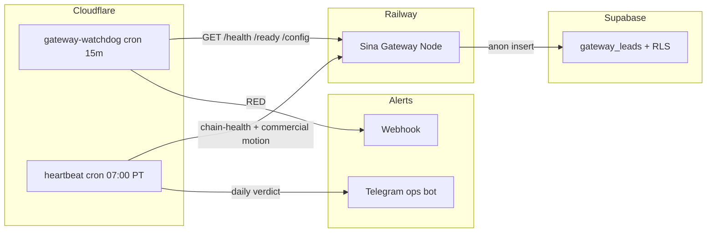

# Sina Gateway — 24/7 Agentic Ops Plan (Locked)

**Status:** Locked for founder use · **Date:** 2026-07-05  
**Doctrine:** UNLOCK DOCTRINE v2 §6 · **Scope:** Gateway chain + watchdog + heartbeat + self-improve loop

---

## One-line

**Cloudflare cron watches the chain, Railway runs capture, Supabase holds receipts, Telegram delivers verdicts — green infra with zero commercial motion is still RED.**

---

## Chain map



---

## Layer responsibilities

| Layer | Job | Self-heal | Self-improve |
|-------|-----|-----------|--------------|
| **Railway** | Run gateway 24/7, auto-restart on crash | Platform restart policy | Deploy from `main` on push |
| **Supabase** | Persist leads, insert-only RLS | Founder restores paused project | Schema drift check in CI |
| **Cloudflare Worker** | Cron probe every 15m | Alert webhook on RED | Tune thresholds from false positives |
| **Heartbeat (07:00)** | Daily verdict to Telegram | Re-run failed checks | Add `offers_sent`, L2 receipts |
| **Founder** | Unpause Supabase, run SQL, approve offer sends | Manual only at L4 | D7 channel kill/keep |

---

## Current chain health (evidence)

Run locally:

```bash
SMOKE_BASE_URL=https://sina-gateway-production.up.railway.app npm run smoke
npm run chain:health
```

| Check | Expected when healthy |
|-------|----------------------|
| `/health` | `200`, `ok: true` |
| `/ready` | `200`, `captureMode: supabase`, `supabaseTableReady: true` |
| `/api/config` | `captureMode: supabase`, `FounderAudit` routes present |
| `npm run verify:supabase` | `INSERT OK` + `READ DENIED BY RLS` |
| POST `/api/leads` | `200` with route + priority (requires `Origin` in production) |

**Known blocker until SQL applied:** `gateway_leads` table missing → `/ready` returns `503`, capture fails.

---

## Fix gate (founder — do once)

1. Supabase → **SQL Editor** → paste full `supabase/schema.sql` → Run  
2. Also run `supabase/migrations/20260705_founder_audit_route.sql` if table already existed pre-FounderAudit  
3. Local: `npm run verify:supabase`  
4. Production: `npm run chain:health`  
5. Submit one browser test lead on live URL  

---

## Phase 1 — Watchdog (deploy now)

**Worker:** `workers/gateway-watchdog/`

```bash
cd workers/gateway-watchdog
npx wrangler secret put WATCHDOG_WEBHOOK_URL   # Telegram or Slack incoming webhook
npx wrangler deploy
```

Cron: `*/15 * * * *` — probes `/health`, `/ready`, `/api/config`.

**Live (manual trigger):** https://gateway-watchdog.sina-kazemnezhad-ca.workers.dev/run

> Cron trigger deploy may require Workers Paid plan. Use `/run` via external cron or upgrade CF plan.

**Secrets (Cloudflare):**

| Var | Purpose |
|-----|---------|
| `GATEWAY_BASE_URL` | `https://sina-gateway-production.up.railway.app` (in wrangler.jsonc) |
| `WATCHDOG_WEBHOOK_URL` | Alert on RED |

---

## Phase 2 — Daily heartbeat (07:00 PT)

Extend existing ops heartbeat (Telegram) with gateway block:

```json
{
  "gateway": {
    "health": "PASS|FAIL",
    "ready": "PASS|FAIL",
    "supabase_table": "PASS|FAIL",
    "capture_mode": "supabase|local"
  },
  "commercial": {
    "offers_sent": 0,
    "replies": 0,
    "L2_receipts": 0,
    "pipeline_by_level": {}
  },
  "verdict": "GREEN|RED"
}
```

**RED rules (locked):**

- Any gateway probe fails → infrastructure RED  
- `offers_sent: 0` for 7 consecutive days → commercial RED (doctrine §6)  
- Infrastructure green + commercial RED → still RED overall  

**Cron:** Cloudflare `0 14 * * *` UTC (= 07:00 Pacific DST) or Railway cron calling `scripts/chain-health.js`.

**Live (manual trigger):** https://gateway-heartbeat.sina-kazemnezhad-ca.workers.dev/run

> Heartbeat returns **RED** while `offers_sent: 0` (by design). Infrastructure can be GREEN while verdict is RED.

---

## Phase 3 — Self-healing playbooks

| Failure | Auto | Manual |
|---------|------|--------|
| Railway crash | Railway restart | Check deploy logs |
| Supabase paused | Watchdog RED alert | Restore project in dashboard |
| Table missing | `/ready` 503 + alert | Run `schema.sql` |
| Origin blocked capture | Expected in prod | Add domain to `ALLOWED_ORIGINS` |
| Rate limit spam | 429 auto | Review logs by `requestId` |
| Notification fail | Capture still succeeds | Fix `NOTIFY_WEBHOOK_URL` |

No auto-heal for: schema apply, secret rotation, offer rewrites — founder-gated.

---

## Phase 4 — Self-improvement loop

Mirrors doctrine receipt ladder for **channels**, not people:

```
channel_row = { channel, sent, replies, L1, L2_payments, cost, verdict }
```

Weekly (D7):

1. Run `npm run chain:health` — log receipt  
2. Review channel table — kill `L1 = 0` after 100 sends  
3. Review first 10 gateway leads — route accuracy  
4. One improvement_queue item max — schema, routing copy, or offer only  

**Stop rule:** 100 sends, zero L1 → rewrite offer, not product.

---

## Phase 5 — Optional hardening (after first live lead)

| Item | When |
|------|------|
| Turnstile keys | Before public traffic |
| `NOTIFY_WEBHOOK_URL` | High-priority lead alerts |
| Custom domain on Railway + CF DNS | Brand launch |
| Uptime monitor on `/ready` not just `/health` | After schema live |
| GitHub → Railway auto-deploy | After stable schema |

---

## Commands reference

```bash
npm run smoke                    # shallow HTTP checks
npm run chain:health             # deep chain + supabase verify
npm run readiness                # full local gate
npm run verify:supabase          # insert + RLS denial
```

Production smoke:

```bash
SMOKE_BASE_URL=https://sina-gateway-production.up.railway.app npm run smoke
CHAIN_HEALTH_BASE_URL=https://sina-gateway-production.up.railway.app npm run chain:health
```

---

## One-line form

**Probe every 15 minutes, verdict every morning, capture on receipts, improve one channel row per week — never confuse green servers with a moving company.**
