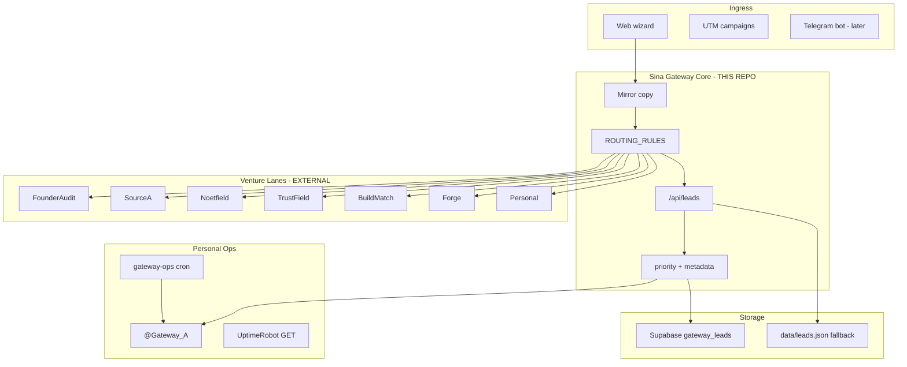

# Sina Gateway — Megagateway Blueprint v1

**Status:** Locked · **Date:** 2026-07-06  
**Scope:** This repo only · **Operator:** Sina Kazemnezhad (personal)  
**Constitution:** [`SINA_GATEWAY_CONSTITUTION_LOCKED_v1.md`](./SINA_GATEWAY_CONSTITUTION_LOCKED_v1.md)  
**SSOT:** [`SINA_GATEWAY_SSOT_LOCKED_v1.md`](./SINA_GATEWAY_SSOT_LOCKED_v1.md)

---

## §1 — Thesis

Most founders run **many doors** (LinkedIn, email, DMs, forms) into **one overwhelmed brain**. Ventures multiply; intake stays chaotic.

**Sina Gateway** is the **single personal front door**: one wizard, one capture pipeline, one ops channel — **deterministic routing** to named venture lanes. The gateway **learns** from receipts; it does **not** become those ventures.

**One line:** *My personal megagateway — route every signal honestly, tag it, alert me when it matters, hand off to the right lane.*

---

## §2 — Architecture

---

## §3 — Layers (do not collapse)

| Layer | Lives in | Must not |
|-------|----------|----------|
| **L0 Constitution** | `docs/SINA_GATEWAY_CONSTITUTION_*` | Change with every feature |
| **L1 Intake UI** | `public/` | Impersonate venture brands |
| **L2 Routing engine** | `src/gateway.js` | Use ML before 500+ labeled rows |
| **L3 Capture API** | `src/server.js` | Expose service-role |
| **L4 Ops** | `workers/gateway-ops`, Railway env | Spam Telegram when green |
| **L5 Venture handoff** | Founder manual + lane repos | Auto-forward PII to third parties |

---

## §4 — Routing philosophy

1. **Rules before models** — every decision has `route_rule_id` + `route_reason`.
2. **UTM is intent** — campaign params tune copy and rules (`founder-audit`, `sourcea`, `buildmatch`).
3. **Notes are signal** — keyword rules for trust/founder patterns.
4. **Default is honest** — unresolved strategic signals → Noetfield lane, not a black hole.
5. **Secondary route** — reserved for ambiguous cases (future).

Code truth: `ROUTING.md` + `npm run audit:routes`.

---

## §5 — Learning loop (gateway-only)

The gateway learns **operations**, not venture strategy:

| Input | Learning output |
|-------|-----------------|
| UTM → submit rate | Which wedge to market next season |
| Lane volume | Capacity planning per lane |
| Priority distribution | Alert fatigue tuning |
| `ref=` chains | Which intros convert |
| Watchdog history | Infra weak points |

**Does not learn:** pricing for SourceA, Noetfield term sheets, TrustField compliance posture — those stay in **lane SSOTs**.

---

## §6 — Telegram doctrine

| Component | Behavior |
|-----------|----------|
| `@Gateway_A` channel | Personal operator room; charter pinned |
| Watchdog | Message **only** on probe FAIL |
| Heartbeat | Message on infra RED; commercial only if `COMMERCIAL_ARMED` |
| Lead alert | High-priority captures only |
| Bot commands | Future (`/start`, `/status`) — not v1 blocker |

Silence when green is **correct**, not broken.

---

## §7 — Evolution phases

| Phase | Name | Gateway state |
|-------|------|----------------|
| **0** | Private test | noindex, robots block |
| **1** | Public intake | **current** — indexable, Turnstile, Telegram alerts |
| **2** | Wedge motion | Founder Audit outbound + armed commercial heartbeat |
| **3** | Lane landings | `/founder-audit`, `/for-clients`, more as needed |
| **4** | Bot intake | Telegram mini-wizard → same capture schema |
| **5** | Admin read | Founder dashboard after real row count |
| **6** | AI cofounder product | See `FOUNDER_GATEWAY_BLUEPRINT` — **separate product**, same operator |

---

## §8 — Anti-patterns (never)

- Merge Noetfield corporate identity into gateway footer
- Fake “team” or “we” for solo operator
- Route POST probes through UptimeRobot
- Commercial GREEN with `offers_sent=0` when armed
- Seven simultaneous marketing wedges
- Edit SourceA/NOOS repos from gateway tasks without scope

---

## §9 — Success metrics (gateway-native)

| Metric | Target |
|--------|--------|
| Capture success rate | >99% when Supabase up |
| Routing explainability | 100% rows have `route_reason` |
| High-priority alert latency | <30s to Telegram |
| False Telegram spam | 0 daily “all green” posts unless weekly opt-in |
| Founder review SLA | 48h business days (stated on success screen) |
| Identity incidents | 0 public claims of venture corporate authority |

---

## §10 — Related blueprints (external patients)

| Doc | Patient | Relation to gateway |
|-----|---------|---------------------|
| `UNLOCK_DOCTRINE_LOCKED_v2.md` | Any receipt-native system | Shared philosophy |
| `FOUNDER_GATEWAY_BLUEPRINT_LOCKED_v1.md` | Solo founder OS product | **Downstream product** fed by FounderAudit lane |
| SourceA / Noetfield docs | Those ventures | **Handoff targets**, not owners of this repo |

---

## Amendment

v1 locked 2026-07-06. Changes require founder ack + SSOT amendment log entry.
